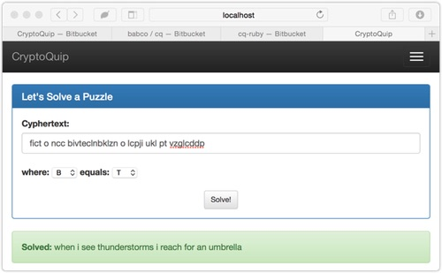

# cq

The standard CryptoQuip, as it appears in the comics, is a simple substitution
cypher where one part of the solution is provided, and it's up to the player to
figure out the rest from the provided cyphertext and the clue. It's a fun little
puzzle to play, but that doesn't stop a more _analytical_ approach.

This project is about a few different attacks on solving the general CryptoQuip
puzzle in as short a time as possible. There are other versions of this same
attack, and there are several different attack schemes. This just happens to be
the fastest we've found.

[](https://gitpod.io/#https://github.com/drbobbeaty/cq) 

## Web Server Usage

At this time we have a limited web server in the `server` namespace, and it can
handle a few requests. To start it, simply:

```bash
$ lein run web
```

and then hit:

```
GET localhost:8080/info
```

and you'll see the _hello_ output:

```json
{
  "app": "cryptoquip solver",
  "code": "unknown commit",
  "hello?": "World!"
}
```

The goal is to have the _uberjars_ include the git hash, and then have this in
the response. I've got the code for extracting it, I just need to work in the
code for renaming the _uberjar_.

To see the benchmark code, hit:

```
GET localhost:8080/benchmark
```

and you'll see the cyphertext, the clue, and the plaintext:

```json
{
  "clue": { "b": "t" },
  "cyphertext": "fict o ncc bivteclnbklzn o lcpji ukl pt vzglcddp",
  "plaintext": "when i see thunderstorms i reach for an umbrella"
}
```

The log file has all the details about what's being called, etc.

More endpoints to be added soon.

## Running the Solver from the Web

We have added a simply jQuery/Bootstrap front-end to the solver so that it can be easily run by anyone simply going to `localhost:8080/` on the main site. It looks something like this:

<p align="center">
  
</p>

You can simply enter your cyphertext, and then enter your key, and hit `Solve!`, and if there's a solution, it will be presented. Simple.

## Command Line Usage

Right now, there are tests that run a standard quip, and the `main` also runs
a standard quip - directing the output to `log/cq.log` for debugging and
monitoring purposes. Simply:

```bash
$ lein run block
```

and then the log will have something like:

```bash
[2014-12-16 08:26:07.973:main] INFO  cq.block - Finished attack [word: 5] in 0ms.
[2014-12-16 08:26:07.973:main] INFO  cq.block - Finished attack [word: 4] in 2ms.
[2014-12-16 08:26:07.974:main] INFO  cq.block - Finished attack [word: 3] in 3ms.
[2014-12-16 08:26:07.974:main] INFO  cq.block - Finished attack [word: 2] in 3ms.
[2014-12-16 08:26:07.989:main] INFO  cq.block - Finished attack [word: 8] in 4ms.
[2014-12-16 08:26:07.989:main] INFO  cq.block - Finished attack [word: 7] in 14ms.
[2014-12-16 08:26:07.989:main] INFO  cq.block - Finished attack [word: 6] in 15ms.
[2014-12-16 08:26:07.989:main] INFO  cq.block - Finished attack [word: 5] in 15ms.
[2014-12-16 08:26:07.990:main] INFO  cq.block - Finished attack [word: 4] in 15ms.
[2014-12-16 08:26:07.990:main] INFO  cq.block - Finished attack [word: 3] in 16ms.
[2014-12-16 08:26:07.990:main] INFO  cq.block - Finished attack [word: 2] in 16ms.
[2014-12-16 08:26:07.990:main] INFO  cq.block - Finished attack [word: 1] in 19ms.
[2014-12-16 08:26:07.990:main] INFO  cq.block - Finished attack [word: 0] in 21ms.
[2014-12-16 08:26:07.990:main] INFO  cq.block - Finished solve in 210ms.
[2014-12-16 08:26:07.990:main] INFO  cq.main - solution: when i see thunderstorms i reach for an umbrella
```

## License

Copyright © 2014 BaBCo

Distributed under the Eclipse Public License either version 1.0 or (at
your option) any later version.